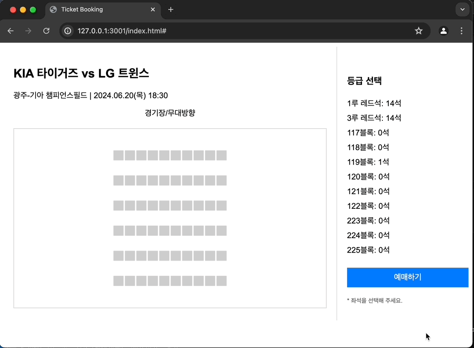
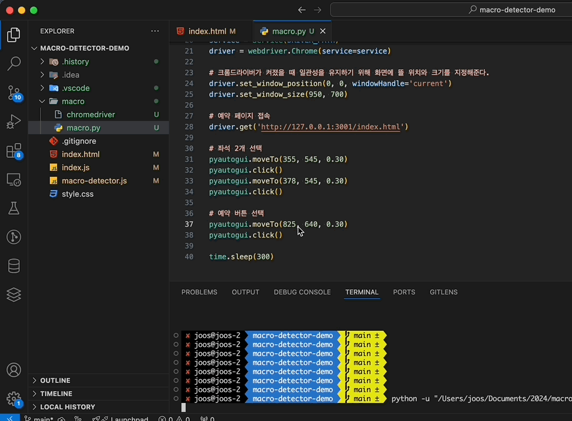
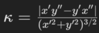
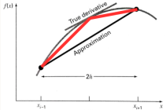

# Macro Detector

This package automatically detects whether a macro program is being used simply by importing it.

Latest Version : `1.02` (2024.06.28)

---

## Table of Contents

- [Installation](#installation)
- [Usage](#usage)
- [API](#api)
- [Example](#example)
- [Snapshot](#snapshot)
- [How?](#how)
- [Paper](#paper)
- [License](#license)

---

## Installation

You can install the package using npm:

```sh
npm i macro-detector
```

[https://www.npmjs.com/package/macro-detector](https://www.npmjs.com/package/macro-detector)

---

## Usage

To use the `macro-detector` library, you need to import the `initMacroDetector` function and call it with the ID of the target element.

```javascript
import { initMacroDetector } from 'macro-detector';

initMacroDetector('macro-detect-target');
```
```html
<head>
    ...
    <script src="{path-of-macro-detector.js}" defer onload="initMacroDetector('macro-detect-target');"></script>
</head>
```

매크로 프로그램을 이용한 비정상적인 접근 여부 판단하려면, initMacroDetector 함수의 매개변수로 지정한 문자열로 클릭 이벤트가 발생하는 컴포넌트(예: 예약 플로우의 예매 버튼)에 ID를 지정하세요.   
본 라이브러리는 해당 컴포넌트의 클릭 이벤트가 발생하는 순간 매크로 프로그램을 통한 접근 여부를 판단합니다.   
비정상적인 접근으로 판별될 경우, 브라우저 상에 경고(alert)를 띄웁니다.  

To determine whether abnormal access using a macro program has occurred, assign an ID to the component where the click event occurs (e.g., the booking button in a reservation flow) that matches the string specified as the parameter of the initMacroDetector function.   
This library will determine if the access was made using a macro program at the moment the click event occurs on the specified component.   
If abnormal access is detected, an alert will be displayed in the browser.

---

## API

### `initMacroDetector(targetId: string): void`

Initializes the macro detector. The function takes a single argument, `targetId`, which is the ID of the target element (e.g., a button) that will trigger the macro detection when clicked.

- `targetId` (string): The ID of the target element.

---

## Example

Here is an example of how to use `macro-detector` in a React application.

```javascript
import React, { useEffect } from 'react';
import { initMacroDetector } from 'macro-detector';

const App: React.FC = () => {
    useEffect(() => {
        initMacroDetector('macro-detect-target');
    }, []);

    return (
        <div>
            <button id="macro-detect-target">Detect Macro</button>
        </div>
    );
}

export default App;
```

[Simple Example Projects](https://github.com/thisIsJooS/macro-detector-demo)

---

## Snapshot

### `normal approach`

### `abnormal approach`
Mouse cursor was controlled using the [pyautogui](https://pyautogui.readthedocs.io/en/latest/index.html) library.


---

## How?

### `Flow`
1. 마우스의 이동경로 (좌표) 를 지속적으로 수집합니다.
2. target 컴포넌트 이외에서 클릭이벤트가 발생할 경우 좌표를 저장하고 있는 배열이 초기화됩니다. 
3. target 컴포넌트에서 클릭이벤트가 발생할 경우, 배열에 담겨 있는 마우스 이동경로 (좌표) 의 곡률을 분석하여 매크로를 판별합니다.
   - 비정상적으로 빠른 이동 (수백 ms 사이의 이동과 클릭) 이 발생할 경우 좌표 수집이 제대로 이루어지지 않아 매크로 프로그램을 통한 접근으로 간주합니다.


1. The mouse movement path (coordinates) is continuously collected.
2. If a click event occurs outside of the target component, the array storing the coordinates is reset.
3. If a click event occurs on the target component, the curvature of the mouse movement path (coordinates) in the array is analyzed to detect macros.
   - If abnormally fast movements (movements and clicks within a few hundred milliseconds) occur, the coordinates are not collected properly, and it is considered access using a macro program.


### `곡률 계산 (Then how is this calculating the curvature?)`

> 마우스 이동 경로를 분석하여 매크로 여부를 판단하기 위해 미적분학에서의 곡률 판단 공식을 활용한다. 
> 그러나, 주어진 좌표들을 통해 완벽한 곡선을 만들 수 없기 때문에 정확한 미분값을 얻기 어렵다. 
> 이를 해결하기 위해 중앙 차분법(Central Difference Method)을 사용하여 곡률 값을 계산한다. 
> 중앙 차분법은 인접한 두 점 사이의 변화를 이용하여 미분값을 근사적으로 계산하는 방법으로, 불완전한 데이터로부터 곡률을 추정하는 데 효과적이다.

> To determine whether a macro is being used by analyzing the mouse movement path, we utilize the curvature calculation formula from calculus. However, it is difficult to obtain accurate derivative values because a perfect curve cannot be created from the given coordinates. To address this, we use the Central Difference Method to calculate the curvature values. The Central Difference Method is an approach that approximates the derivative by using the changes between two adjacent points, making it effective for estimating curvature from incomplete data. 


|             Curvature Fomula              |             Central Difference Method              |
|:-----------------------------------------:|:--------------------------------------------------:|
|  |  |

---

## Paper
Here is the paper I wrote when I first started this project.  
▶️  [Paper (Google Drive)](https://drive.google.com/file/d/14VLJlu8YvvCGRB9LqQnQnCJf17MIJz-M/view?usp=sharing)

--- 

## License

This project is licensed under the MIT License. 
